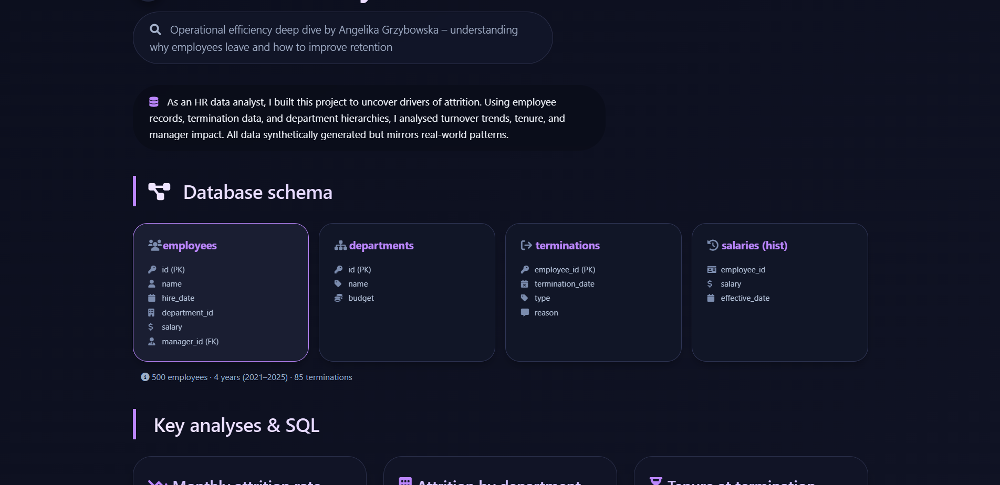
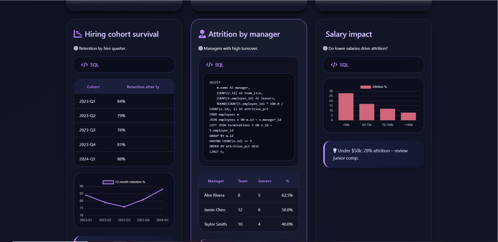

# 👥 Personal HR Analytics Portfolio

### Projekt von Angelika Grzybowska

Das ist mein Projekt, in dem ich zeige, wie man HR-Daten analysiert und daraus strategische Personalentscheidungen ableitet.

---

## Worum geht es?

In Unternehmen entstehen jeden Tag große Mengen an Personaldaten. Aber Zahlen allein bringen nichts. Der eigentliche Mehrwert entsteht, wenn man erkennt, warum Mitarbeiter das Unternehmen verlassen, welche Faktoren die Mitarbeiterzufriedenheit beeinflussen und wie datenbasierte Entscheidungen die Personalstrategie verbessern können.

Deshalb habe ich dieses Portfolio erstellt. Es zeigt, wie man Rohdaten in aussagekräftige Business Insights verwandelt und datenbasierte Entscheidungen im Human Resources Management trifft.

---

## Was ist drin?

- Analyse von Mitarbeiter-, Abteilungs- und Leistungsdaten
- Interaktive Dashboards und KPI-Tracking
- Employee Turnover Analysis (Fluktuationsanalyse)
- Analyse von Mitarbeiterzufriedenheit und Engagement
- Analyse von Gehältern und Leistungsbewertungen
- Identifikation von Trends und Risikofaktoren
- Datengetriebene Handlungsempfehlungen für HR-Abteilungen
- Kompletter Workflow: von Rohdaten bis zu strategischen Erkenntnissen

---

## Technik

- SQL
- Google Sheets & Excel
- Datenvisualisierung
- KPI-Design
- Datenbereinigung und Transformation
- Explorative Datenanalyse (EDA)
- Business Intelligence
- Dashboard Design
- HR Analytics
- Datengetriebenes Storytelling

---

## Welche Data-Analytics-Skills ich angewendet habe

Dieses Projekt demonstriert Fähigkeiten, die von Data Analysts und HR Analysts besonders gefragt sind:

- Strukturierung und Bereinigung komplexer Personaldaten
- Analyse von Mitarbeiterfluktuation und Retention
- Berechnung von HR-Kennzahlen und KPIs
- Identifikation von Mustern im Mitarbeiterverhalten
- Übersetzung von Daten in konkrete HR-Empfehlungen
- Kommunikation komplexer Analysen durch verständliche Visualisierungen
- Verknüpfung von technischem Know-how mit Business-Denken

---

## Screenshots

   

---

## So kannst du es anschauen

Die fertige Präsentation findest du hier:

👉 https://personal-hr-analyse.netlify.app

---

## Was ich gelernt habe

Durch dieses Projekt habe ich gelernt, dass gute HR-Analysen weit über schöne Diagramme hinausgehen. Der wichtigste Teil besteht darin, die richtigen Fragen zu stellen, Zusammenhänge im Mitarbeiterverhalten zu erkennen und aus Daten strategische Entscheidungen abzuleiten.

Ich habe meine Fähigkeiten in SQL, Datenvisualisierung, KPI-Entwicklung, explorativer Datenanalyse und Business Storytelling deutlich vertieft und ein Portfolio-Projekt aufgebaut, das zeigt, wie ein Data Analyst reale Herausforderungen im Human Resources Bereich löst.

Ich hoffe, dieses Projekt hilft anderen Studenten und angehenden Data Analysts zu verstehen, wie aus Personaldaten echte Erkenntnisse und bessere Personalentscheidungen entstehen.

---

**Angelika Grzybowska**

**Juni 2026**
